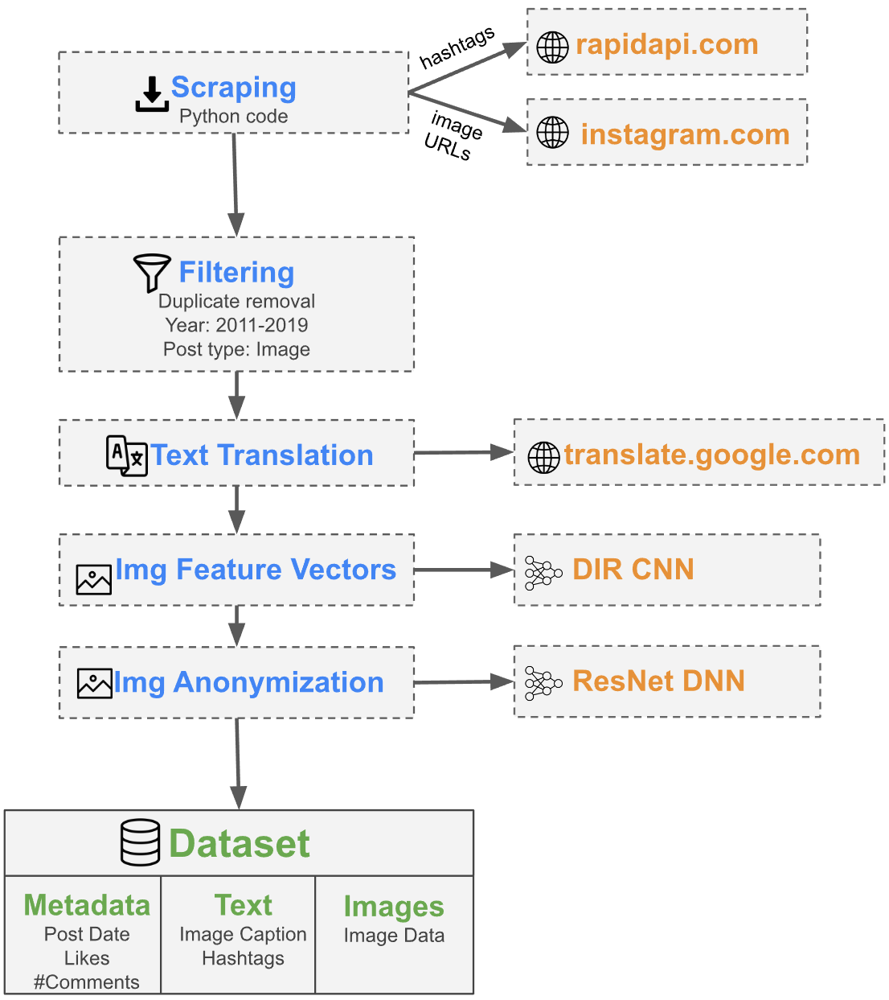

This is one of two repositories for my master's thesis:
1. Data scraping and processing: This repo
2. Data analyis: https://github.com/solfang/IconicArchitecture

# Scraping and Preprocessing Pipeline

## Overview
This repo provides an automated pipeline to scrape social media data and process it, including data cleaning and filtering, text translation, image labeling and image anonymization (currently it's only set up for Instagram data). If you have trouble running the pipeline, feel free to copy the functionality classes (see 'The stages') as they are able to run on their own.

## How to run
I created a dummy config for the pipeline that lets you download and process a dummy dataset.

Before running the pipeline for the first time, a few things need to be set up:
1. install `requirements.txt`: `pip install -r requirements.txt` (preferably in a virtual environment) (tested on Python 3.7)
2. Run in shell: `python -m spacy download en_core_web_sm` (needed for spacy language detection)
3. Unzip `data.zip` one folder layer above this repository (this will mimic the output of the scraping stage). The resulting folder structure should be:
 - [...]/some folder/
	- Social-Media-Data-Pipeline/
	- data/
4. Deep Image retrieval code and model:
	4.1 Download https://github.com/naver/deep-image-retrieval and place it at Preprocessing/FeatureVectors/deep-image-retrieval.
	4.2 Download the Resnet101-AP-GeM-LM18 model from https://github.com/naver/deep-image-retrieval/#pre-trained-models, unzip it and place it under `.../deep-image-retrieval/dirtorch/models/Resnet101-AP-GeM-LM18.pt`

To run the pipeline: `orchestrator.py`

Optionally, specify the arguments:
  - `--config`: path to a pipeline config file (default: config/test.json - this will download a dummy dataset)
  - `--root_dir`: path to a root directory where the pipeline output will be stored (default: ../data/social_media_scraping)

To run the scraper normally you will need to get an an API key from https://rapidapi.com/logicbuilder/api/instagram-data1 (paid service) and put it into Scraper/RapidAPI/api_key.json (+make sure the file is in gitignore)

Notes:
- For the feature vector calculation you will need a decently fast graphics card. Otherwise it will take literal ages.
- Repos/services used:
	- https://rapidapi.com/logicbuilder/api/instagram-data1
	- https://github.com/naver/deep-image-retrieval (needs to be downloaded and placed in this repo)
	- https://github.com/CSAILVision/places365 (a light version comes automatically with this repo)

## The Pipeline
The pipeline contains multiple processing stages and is defined by a config file, see config/ folder for examples.
`orchestrator.py` manages the pipeline execution by reading a config file and executing the stages.

## The config file
The config file defines some basic info a well as a set of stages to be executed.
- `dataset_name` (string): the pipeline output will be stored to and read from [dataset_name]/[root_dir] (root directory is given to orchestrator.py)
- `skip_stage_if_exists` (bool): if the output of a stage already exists it will be skipped
- `stages`: list of stages containing:
	- `name` (string): name of the stage (can be whatever)
	- `implementation` (string): Should correspond to one of the stages defined in `stages.py`
	- `input` (string or null): input file path for the stage w.r.t the root directory 
	- `output` (string): output file path for the stage w.r.t the root directory 
	- `enabled` (bool): whether the stage will be exectued
	- `params` (dict): stage-specific parameters to be passed to the stage -> see the stage classes for what these parameters do
 
## The stages

You can create your own stages via the config file. Though you will need to pass an implementation for that stage that the pipeline can execute.

Currently, these implementations are available:
| Stage                      | Function                                                                       | Default Implementation                                                                       |
|----------------------------|----------------------------------|---------------------------------------|
| **InstagramFeedScraperStage**  | Scrapes content from Instagram given a search term                             | Scraper.RapidAPI.InstagramFeedScraper |
| **PreprocessorStage**          | Pre-processses posts by filtering etc.                                         | Preprocessing.Preprocessor |
| **ExploratoryanalysisStage**   | Does some shallow summary and basic plotting of important variables            | Exploration.ExploratoryAnalysis |
| **TranslatorStage**            | Translates text                                                                | Preprocessing.Translator |
| **InstagramImageScraperStage** | Scrapes the images associated with the posts                                   | Scraper.RapidAPI.InstagramImageScraper |
| **ImageLabelerStage**          | Labels images using https://github.com/CSAILVision/places365                                          | Preprocessing.ImageLabeling.ImageLabeler |
| **ImageFeatureVectorStage**    | Caluclates feature vectors using https://github.com/naver/deep-image-retrieval | Preprocessing.FeatureVectors.DIRAdapter |
| **ImageAnonymizerStage**       | Pixelates faces in the images                                                  | Preprocessing.ImageAnonymization.ImageAnonymizer |

The stage implementations are defined in `stages.py`.
Requirements between stages, e.g. that stage x has to run before stage y is only defined implicitly since if a stage runs without the previous stage the input file may not be there from the previous stage.

The classes in `stages.py` parse the stage parameters and delegate the actual work. They're just there to provice a common interface.
The delegates, e.g. `Preprocessing/ImageLabeling/ImageLabeler.py` are fully functional by themselves outside of the pipeline if you prefer to use them that way.

## Changing the pipeline

The current stages are tailored for Instagram data.

You can swap out specific stages, e.g. to scrape Crowdtangle instead of using a third-party Instagram scraper:
1. Create new stage classes in `scraper.py` that implement/delegate to the necessary functionality for Crowdtangle
2. Create a new config that declares these stages and change the parameters in the config to match the kind of data found in the Crowdtangle dataset.
Specifcally, you'd probably want to replace the post scraper, pre-processor and image scraper stages with Crowdtangle-specific solutions and change the params of the translation stage in the config. The rest of the stages should work as-is on the new data.